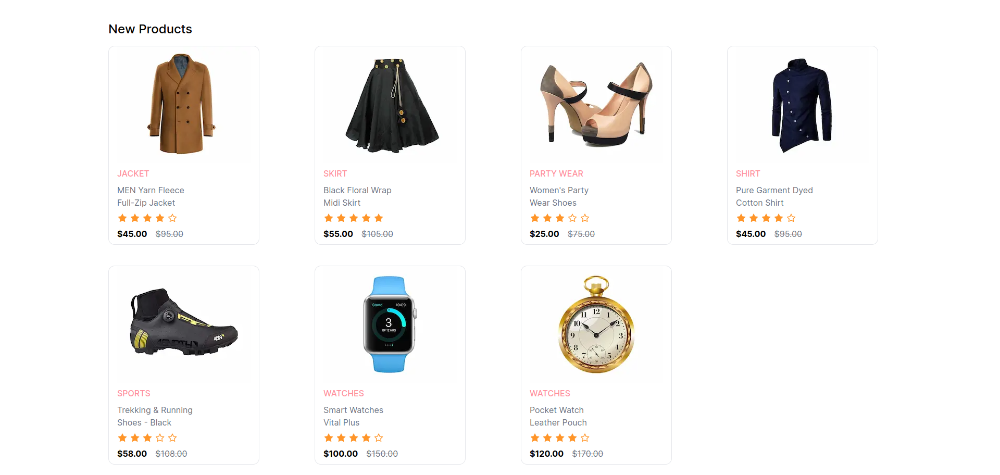

# shopping-website

Welcome to **shopping-website** – your destination for a modern and responsive e-commerce store landing page.

## Overview

This project is built with [Next.js](https://nextjs.org/) and [Tailwind CSS](https://tailwindcss.com/), creating a dynamic and visually appealing online shopping experience. The combination of Next.js and Tailwind CSS ensures seamless responsiveness across all devices, providing an optimal user experience.

## Technologies Used

- **Frontend:** [Next.js](https://nextjs.org/)
- **Styling:** [Tailwind CSS](https://tailwindcss.com/)

## Features

- **Responsive Design:** Immerse yourself in a seamlessly responsive layout for an optimal viewing experience on various devices.

## Screenshots

Include screenshots or images to showcase the visual aspects of your landing page. You can create a folder named `screenshots` within your project repository and place the images there.

## Getting Started

Follow these simple steps to get started with the shopping website:

1. Clone the repository: `git clone https://github.com/your-username/shopping-website.git`
2. Install dependencies: `npm install`
3. Run the development server: `npm run dev`

Feel free to explore and customize the project according to your needs!

## License

This project is licensed under the [MIT License](LICENSE).
